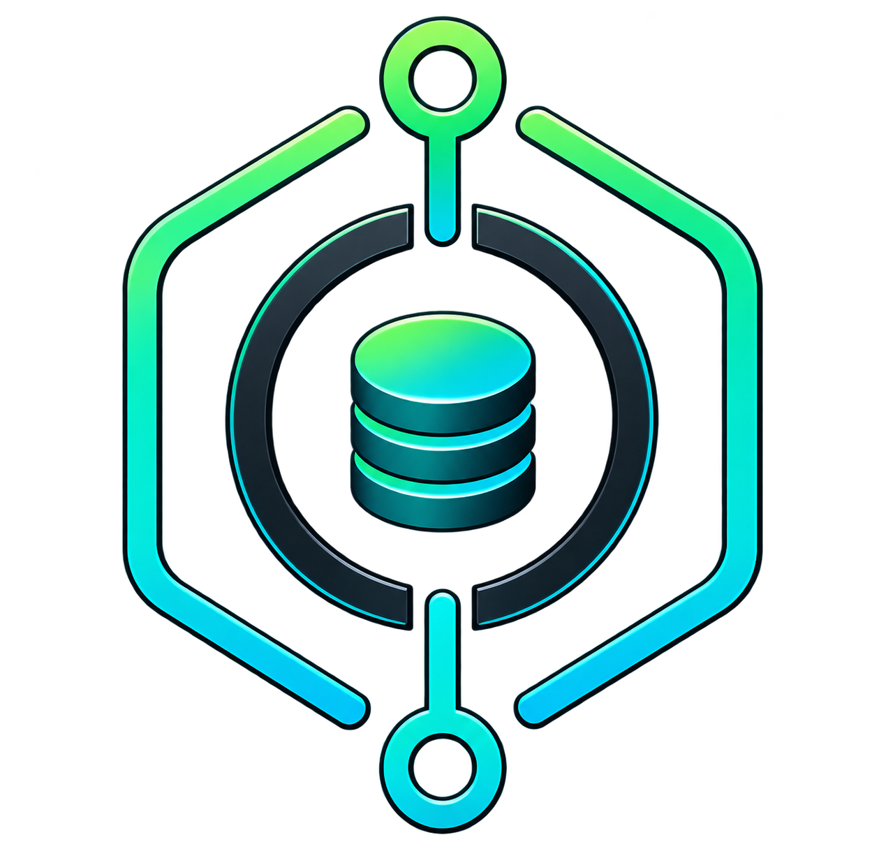

<div align="center">
  
</div>

# Susu

A Solidity implementation of the informal **susu** rotating savings circle,
built as a security-focused DeFi primitive.

**Status:** Active development, under self-audit. **Not audited. Do not use with real funds.**

## Running tests

```bash
forge install
forge test
```

## Stack

- Solidity `^0.8.20`
- Foundry (testing, deployment, PoCs)
- Chainlink VRF (planned, for randomized payout order)
- ERC20 (contributions, collateral)

## Status

Active development. See [`KNOWN_ISSUES.md`](./KNOWN_ISSUES.md) for the current list of identified surface issues being worked through.

## License

MIT — see [`LICENSE`](./LICENSE).